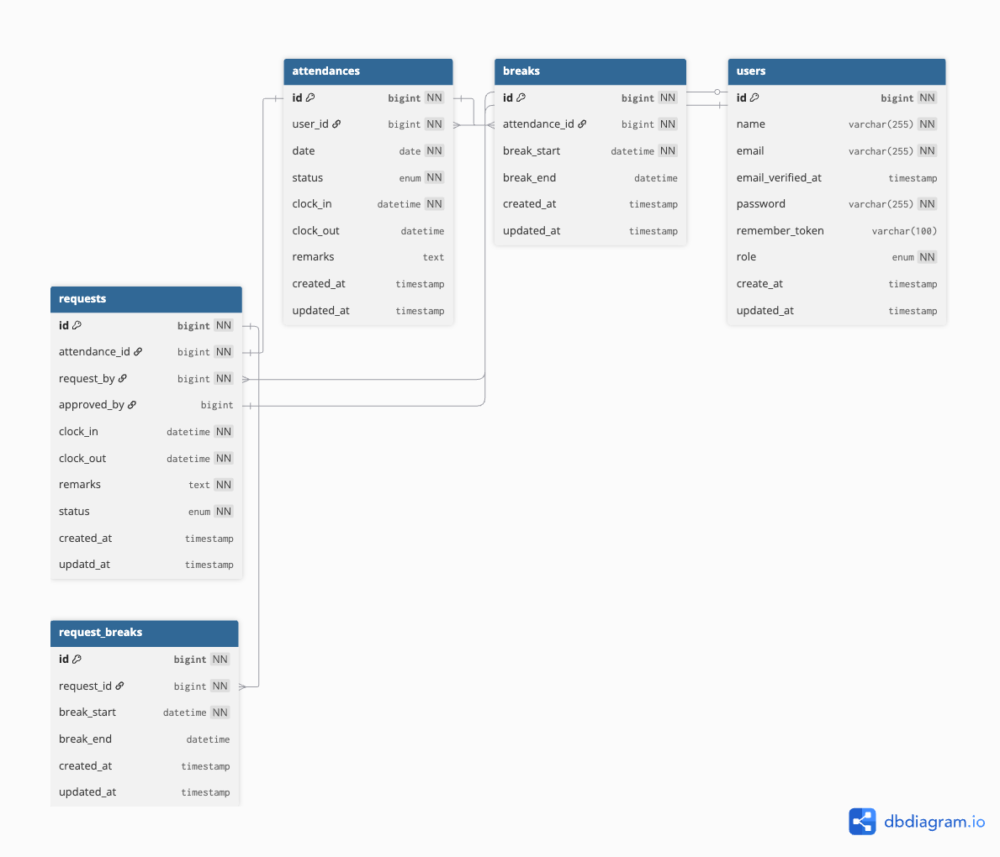

## TIMECARD

1. Dockerを起動してください。

2. git cloneコマンドででGitリポジトリをクローンしてください。
```
git clone git@github.com:matsunagaNatsuki/TIMECARD.git
```

3. プロジェクト直下に移動して以下のコマンドを入力してください。
Dockerのビルドからマイグレーション、シーディングまでを自動で行います。
```
make init
```

## テスト用のデータベースの作成
MySQLコンテナにログインしてください。
```
docker-compose exec mysql bash
```
MySQLコンテナからMySQLにrootユーザでログインするために以下のコマンドを入力してください。
パスワードは'root'でログインしてください。
```
mysql -u root -p
```
MySQLログイン後、以下のコマンドを入力し、'demo_test'を作成してください。
```
CREATE DATABASE demo_test;
```
これで単体テストの使用が可能になります。


## メール認証
mailhogというツールを使用しています。
一般ユーザーの登録はmailhogを使用して会員登録してください。
なお、mailhogで登録したユーザーは一般ユーザ用のユーザーとなります。
管理者ログイン画面のログインはできません。

.envファイルの以下の項目を記述してください。
```
    MAIL_MAILER=smtp
    MAIL_HOST=mail
    MAIL_PORT=1025
    MAIL_USERNAME=null
    MAIL_PASSWORD=null
    MAIL_ENCRYPTION=null
    MAIL_FROM_ADDRESS=任意のメールアドレスを記述してください。
    MAIL_FROM_NAME="${APP_NAME}"
```

## 管理者ユーザーのアカウント
以下のアカウントは管理者ユーザーのアカウントです。
管理者ログイン画面にてログインする際は以下のユーザー名のアカウントでログインしてください。
ちなみに以下のユーザー名は一般ユーザー画面どちらでも使用することができます。

```
name: 松永 菜月
email: test@gmail.com
password: password
```

## 使用技術（実行環境）
- PHP 8.4.8
- Laravel Framework 8.83.29
- mysql  Ver 9.3.0 for macos15.2 on arm64 (Homebrew)

## ER図


## 仕様書の変更
以下の項目の仕様書の変更は事前に運営に許可を得ています。

1. 管理者ログイン画面でログインする管理者ユーザーはセキュリティ面を考慮し,ミドルウェアを使用して前述の「松永 菜月」の管理者アカウントでのみログイン可能となっております。
その他のmailhogで作成した新規ユーザーは全て一般ユーザーのアカウントとなっております。

2. ダミーデータは2025年7,8,9月分の仕様で作成しています。

3. 管理者画面での詳細情報取得機能での「承認待ち」勤怠詳細のデータの反映は一般ユーザーが申請した勤怠の時間を反映している仕様となっています。

4. 一般ユーザーでの詳細情報取得機能での「承認待ち」の勤怠詳細のデータの反映は管理者ユーザーが承認を行なった後、一般ユーザーが申請を行なった時間のデータが反映されます。
管理者画面で承認されるまで、一般画面で表示される勤怠データはそのままの仕様となっております。

5. 管理画面で承認された一般ユーザーの勤怠詳細画面に関しては『承認されました！』といった文言でメッセージを表示させる仕様となっております。

6. 最初にいただいた画面設計と基本設計書のURLのパスに間違いがあったため、運営の許可を得て管理者画面のURLを以下のパスに変更しております。

```
    勤怠一覧画面（管理者）	            /admin/attendances
    勤怠詳細画面（管理者）	            /admin/attendances/{id}
    スタッフ一覧画面（管理者）	        /admin/users
    スタッフ別勤怠一覧画面（管理者）	 /admin/users/{user}/attendances
    申請一覧画面（管理者）	           /admin/requests
    修正申請承認画面（管理者）	        /admin/requests/{id}
```


